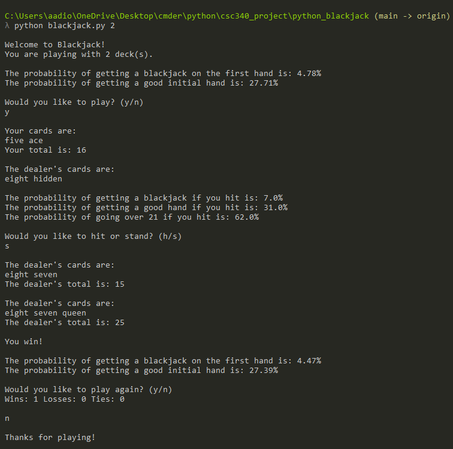

# CSC340 Final Project

The topic I chose for my final project is probability, specifically in the popular casino game, blackjack.

## What you need to run it

First make sure you have python installed on your machine.

Then, make sure to download both python files and put them in the same directory/folder
- blackjack.py
- probability.py

## How to run it
1. Open up your terminal,command prompt, etc... 
2. cd into the directory/folder where you have the two python files 
3. Type in command line `python blackjack.py <number of decks being used>`

## How to play

The terminal will greet you and let you know how many decks you are playing with

It will then prompt you with two different probabilites, getting blackjack on the first hand
and also getting a good inital hand (score from 18-21) and also if you want to play

When you type in `y` to play, it will deal the cards and show the cards you and the dealer have, with the total. It will again
prompt the user with 3 more probabilites if you decide to hit. Type in `h` to hit or `s` to stand.

Repeat this process until you win, lose or tie.

The game will then ask if you want to play again, as well as output the same probabilites at the start, but updated
now that cards have been dealt and also your record of wins,losses and ties.

Note: The deck will be "shuffled" automatically when 70% of cards have been dealt.

## Sample input and gameplay

